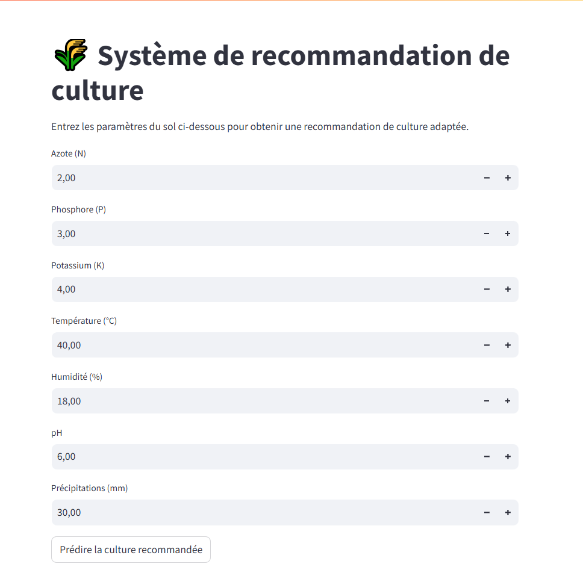

 # 🌾 Crop Recommendation App
Bienvenue dans l'application Crop Recommendation App !
Ce projet est une application web interactive développée avec Streamlit.
Elle prédit la culture agricole la plus adaptée selon les caractéristiques du sol et du climat en utilisant un modèle de Machine Learning.

# 🚀 Fonctionnalités
Entrée utilisateur : Azote (N), Phosphore (P), Potassium (K), Température, Humidité, pH, Précipitations
Transformation des données : log1p sur K et rainfall, puis standardisation avec StandardScaler
Prédiction du type de culture recommandé
Interface web rapide et simple avec Streamlit
Déploiement sur Streamlit Cloud

# 🛠 Technologies utilisées
Python
Streamlit
scikit-learn
pandas
numpy
joblib

# 📦 Installation locale
1-Clonez le dépôt :
git clone https://github.com/MohamedaliBz/crop-recommendation-app.git
cd crop-recommendation-app

2-Installez les dépendances :
pip install -r requirements.txt

3-Lancez l'application :
streamlit run app.py

# 🌍 Déploiement
L'application est déployée sur Streamlit Cloud pour un accès public en ligne.

# 📸 Capture d'écran
